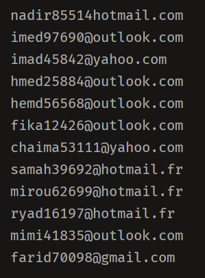

# random emails using python

## Gmail Outllok Yahoo Hotmail and more ...

## تخمين ايميلات عشوائية بستخدام بايثون 3

## يمكنك التعديل على ملف users.txt لي اضافة المزيد من الاسماء 

# run in linux windows termux paydroid3 

``
git clone https://github.com/python-life/random-email
``

``
cd random-email
``

``
python random-email.py
``

Enjoy ;)
